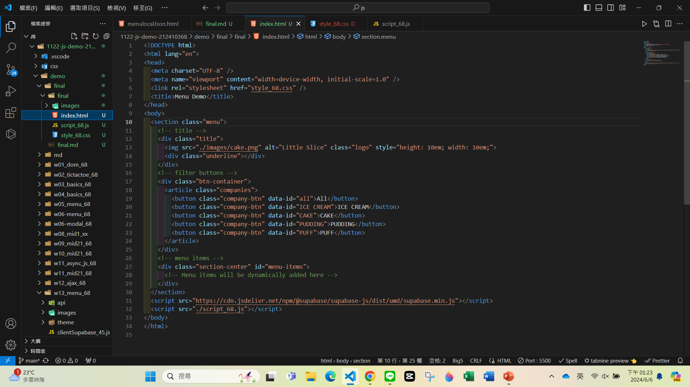
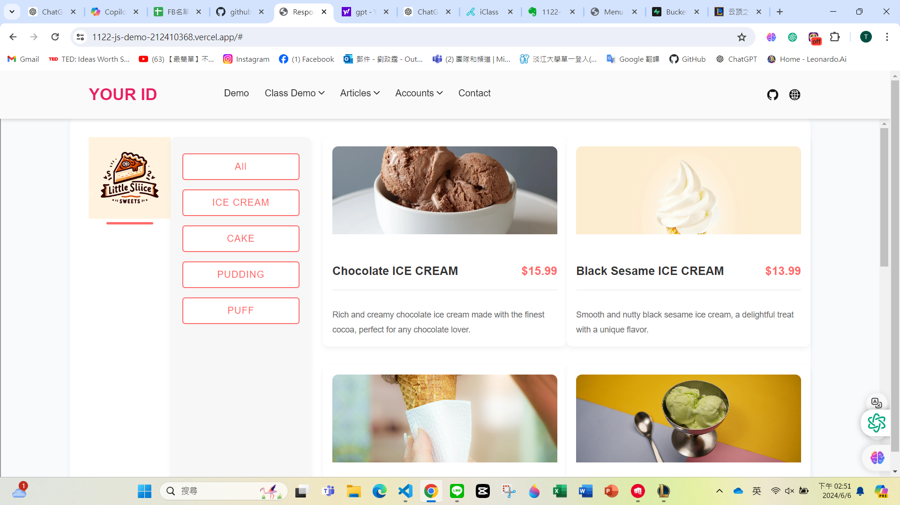
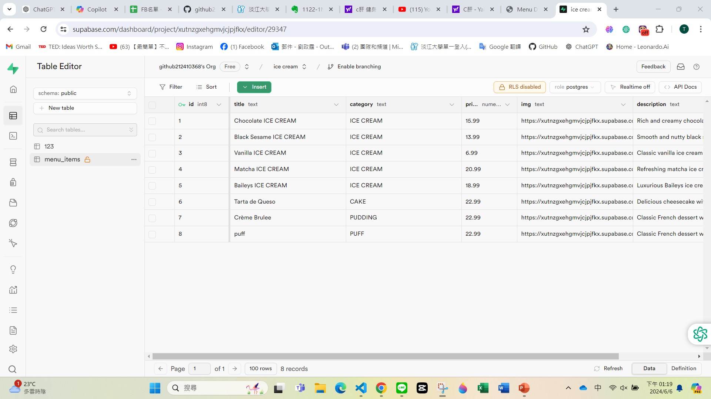
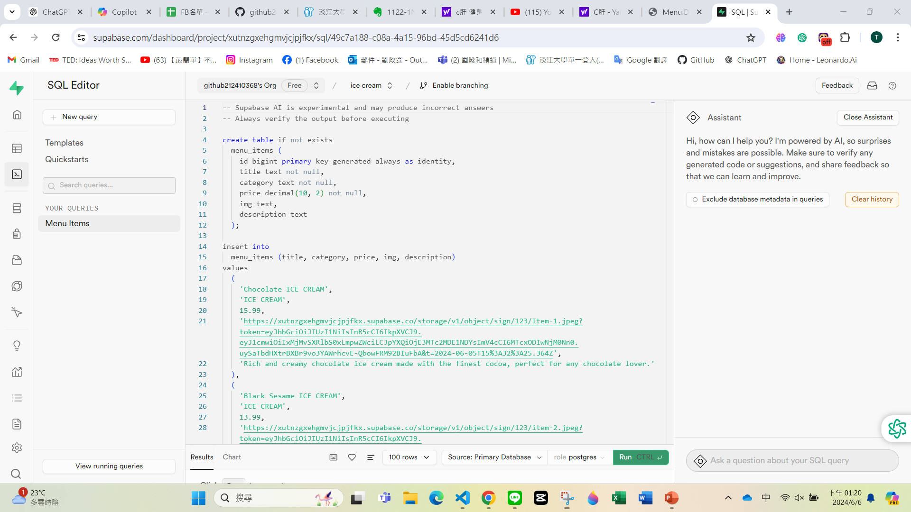
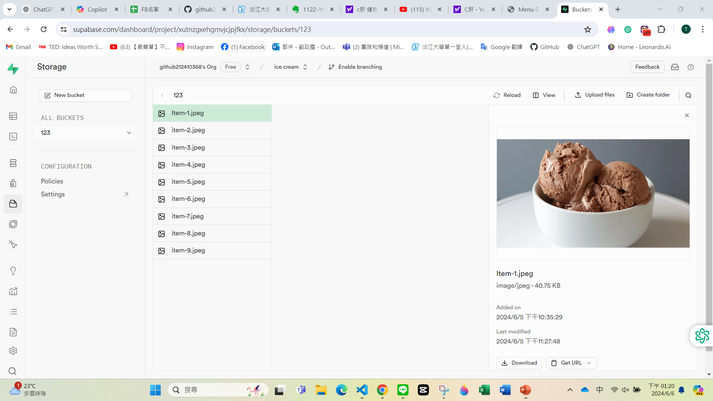
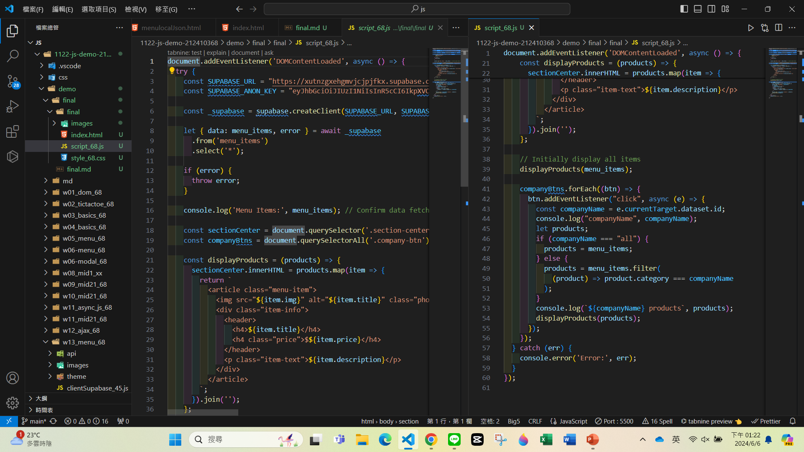
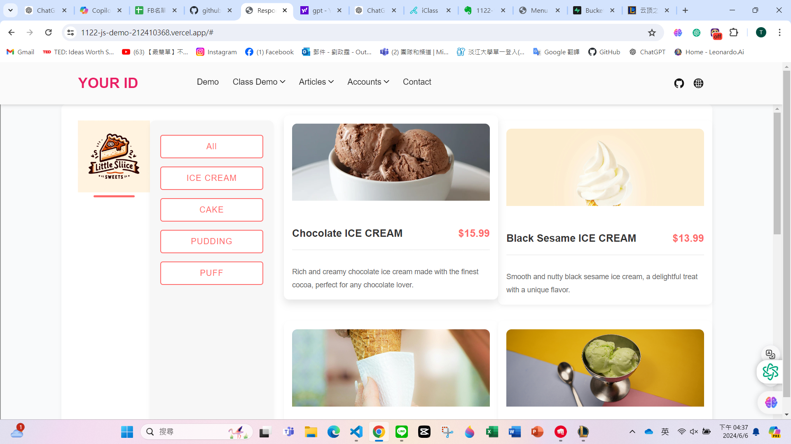

[My Github URL](https://github.com/github212410368/1122-js-demo-212410368.git)

git config --global user.email "212410368@o365.tku.edu.tw"
git config --global user.name "212410368"
$ git log --pretty=format:"%h%x09%an%x09%ad%x09%s" --after="2024-06-05"

### html

### html

##### table editer

### SQL Editor

## Storage

## Javascript

## vercel

