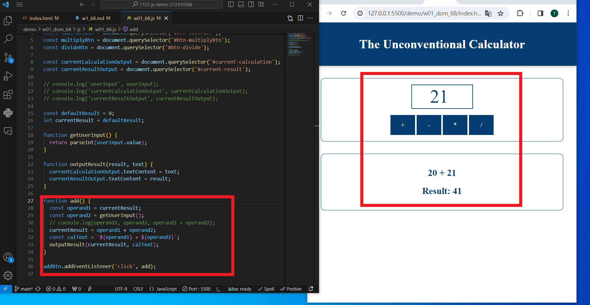
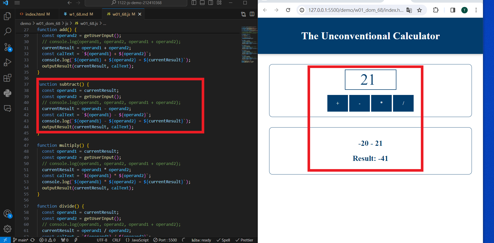
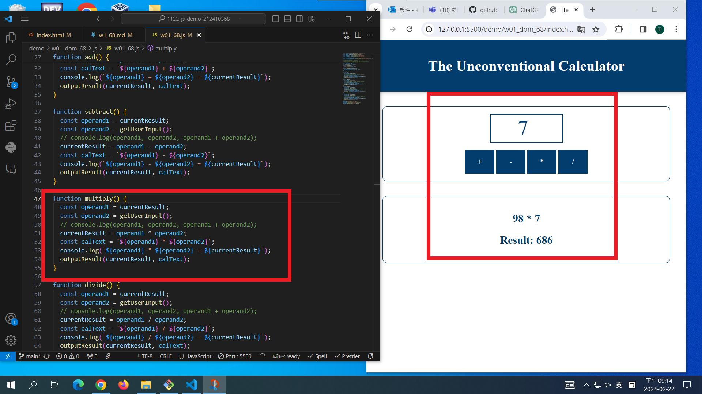
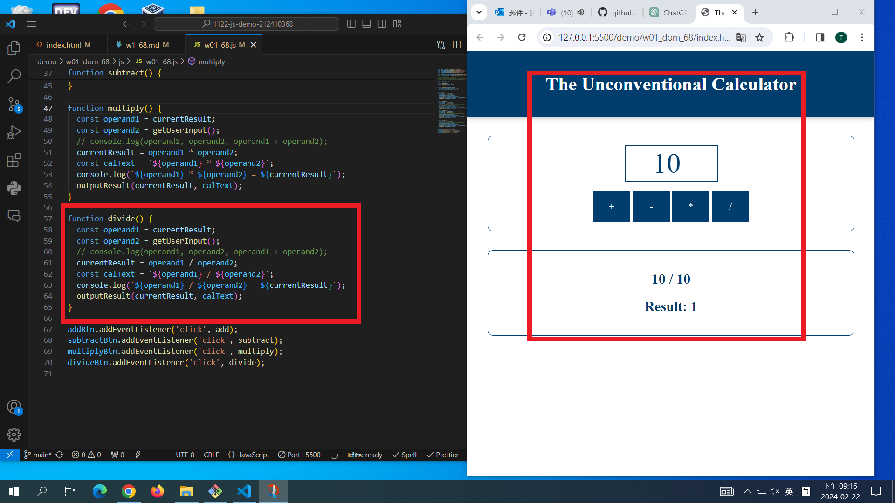
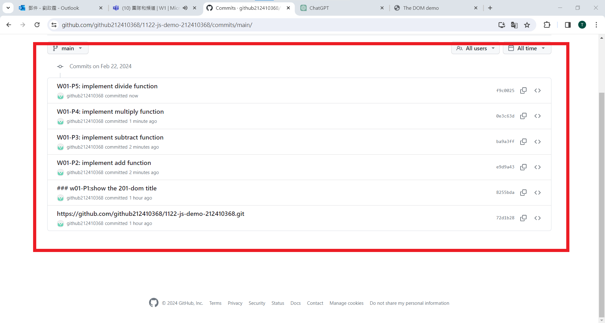

git config --global user.email "212410368@o365.tku.edu.tw"
git config --global user.name "212410368"
$ git log --pretty=format:"%h%x09%an%x09%ad%x09%s" --after="2024-02-20"

### w01-P1:show the 201-dom title


---

w01-P1:show the 201-dom title
72d1b28 212410368

---

---

### W01-P2: implement add function



### W01-P3: implement subtract function



### W01-P4: implement multiply function



### W01-P5: implement divide function

|


### W01-P6: git logs for W01



```
$ git log --pretty=format:"%h%x09%an%x09%ad%x09%s" --after="2024-02-20"
8db3f67 212410368       Thu Feb 22 21:27:23 2024 +0800  W01-P6: git logs for W01
f9c0025 212410368       Thu Feb 22 21:25:49 2024 +0800  W01-P5: implement divide function
0e3c63d 212410368       Thu Feb 22 21:25:05 2024 +0800  W01-P4: implement multiply function
ba9a3ff 212410368       Thu Feb 22 21:24:30 2024 +0800  W01-P3: implement subtract function
e9d9a43 212410368       Thu Feb 22 21:23:49 2024 +0800  W01-P2: implement add function
8255bda 212410368       Thu Feb 22 19:36:04 2024 +0800  ### w01-P1:show the 201-dom title
72d1b28 212410368       Thu Feb 22 19:35:04 2024 +0800  https://github.com/github212410368/1122-js-demo-212410368.git
```
