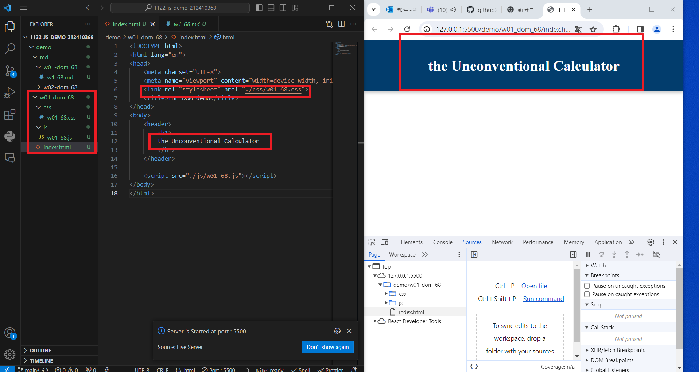

git config --global user.email "212410368@o365.tku.edu.tw"
git config --global user.name "212410368"

### w01-P1:show the 201-dom title



---

---

---

### w01-logs

```
git log --pretty=format:"%h%x09%an%x09%ad%x09%s" --after="2024-02-20"

```
