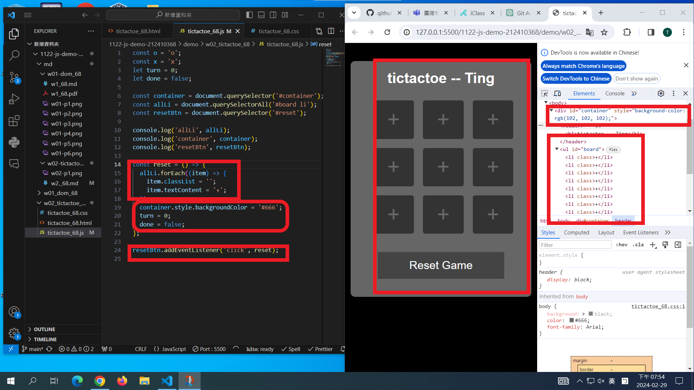
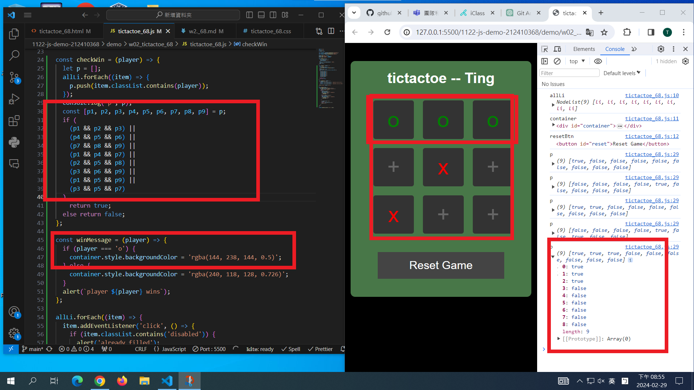
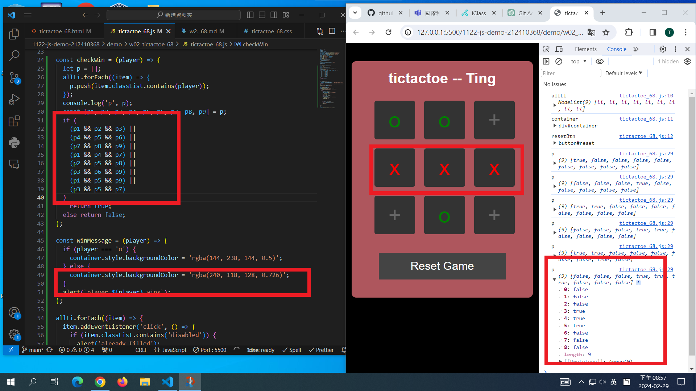
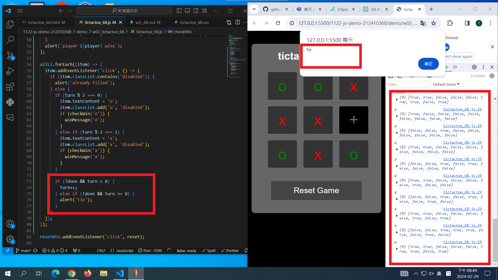

[My Github URL](https://github.com/github212410368/1122-js-demo-212410368.git)

git config --global user.email "212410368@o365.tku.edu.tw"
git config --global user.name "212410368"
$ git log --pretty=format:"%h%x09%an%x09%ad%x09%s" --after="2024-02-28"

### W02-P1: Show Tictactoe css


```
78aa96f 212410368       Thu Feb 29 19:06:54 2024 +0800  ### W02-P1: Show Tictactoe css
```

### W02-P2: implement reset button



```
43b2448 212410368       Thu Feb 29 19:56:52 2024 +0800  W02-P2: implement reset button
```

### W02-P3: implment checkWin(player), and winMessage(player)

#### => player O wins



#### => player X wins



#### => tie game



```
0e2ef5e 212410368       Thu Feb 29 20:58:56 2024 +0800  W02-P3: implment checkWin(player), and winMessage(player)
```

### W01-P4: git logs for W02

```
5dbc054 212410368       Thu Feb 29 21:00:22 2024 +0800  W01-P4: git logs for W02
```
