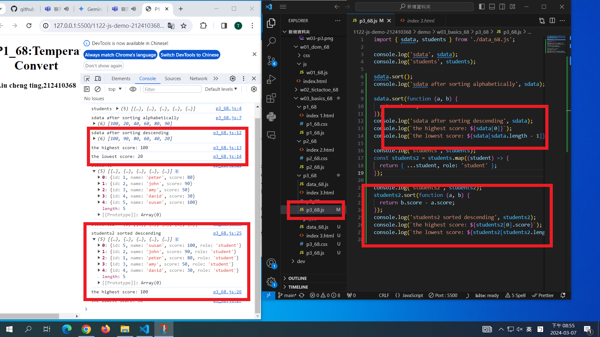

[My Github URL](https://github.com/github212410368/1122-js-demo-212410368.git)

git config --global user.email "212410368@o365.tku.edu.tw"
git config --global user.name "212410368"
$ git log --pretty=format:"%h%x09%an%x09%ad%x09%s" --after="2024-03-06"

### W03-P1: P1_xx temperature convert

### W03-P2: P2_xx temperature convert using Web

##### => From C to F

##### => From F to C

### W03-P3: import sdata and students data from data_xx.js

## W03-P4: Compute highest and lowest score of sdata and students2

## W03-P4:git logs for W03

