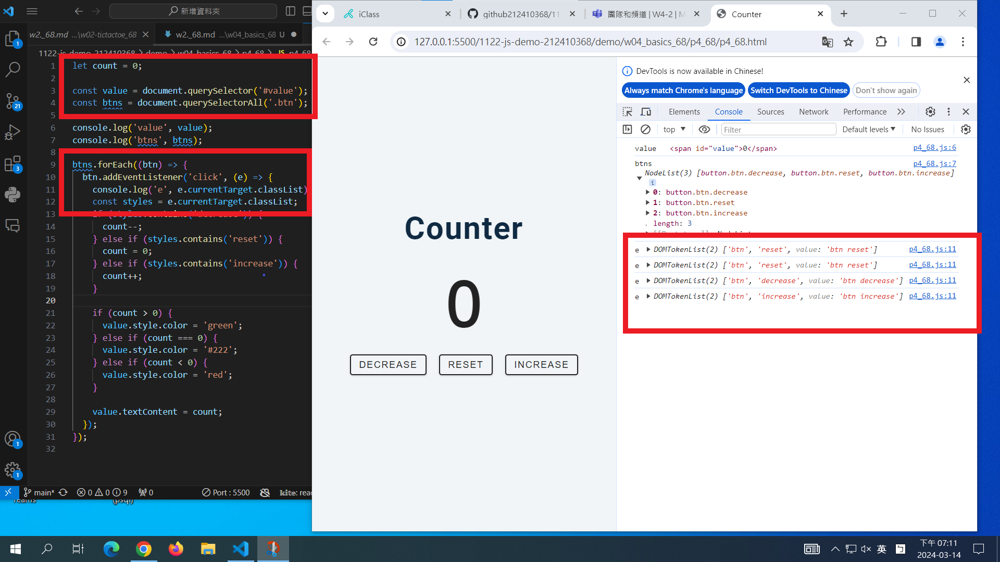
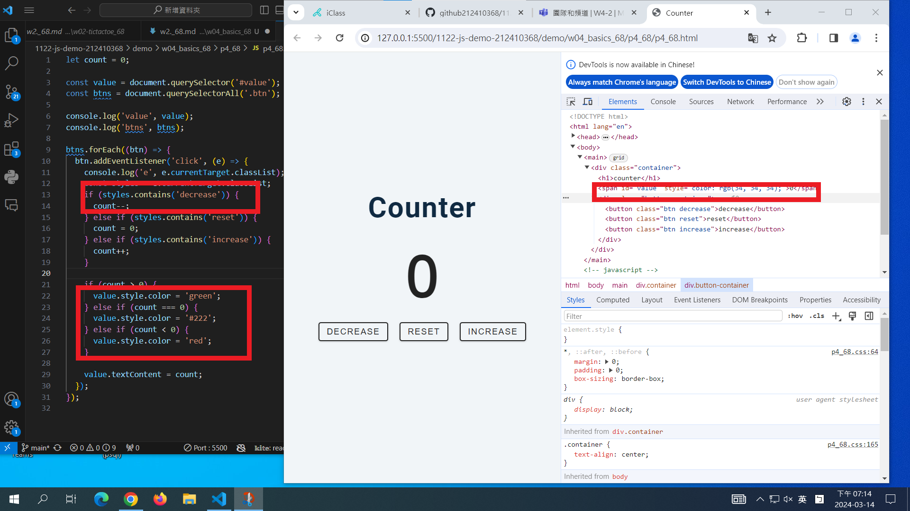
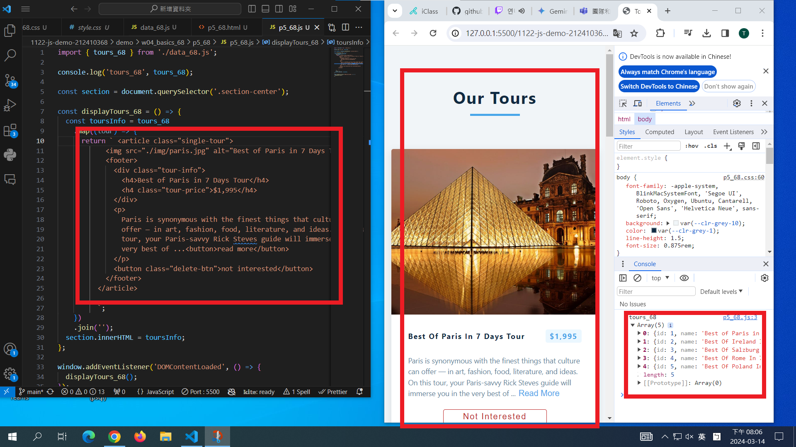

[My Github URL](https://github.com/github212410368/1122-js-demo-212410368.git)

git config --global user.email "212410368@o365.tku.edu.tw"
git config --global user.name "212410368"
$ git log --pretty=format:"%h%x09%an%x09%ad%x09%s" --after="2024-03-13"

### W04-P1: P4_xx -- Counter Demo





```
48ed41c htchung Thu Mar 14 19:03:54 2024 +0800  W04-P1: P4_xx -- Counter Demo
```

### W04-P2: P5_xx -- Tours display two fixed data



```
be59beb htchung Thu Mar 14 19:52:36 2024 +0800  W04-P2: P5_xx -- Tours display two fixed data
```
