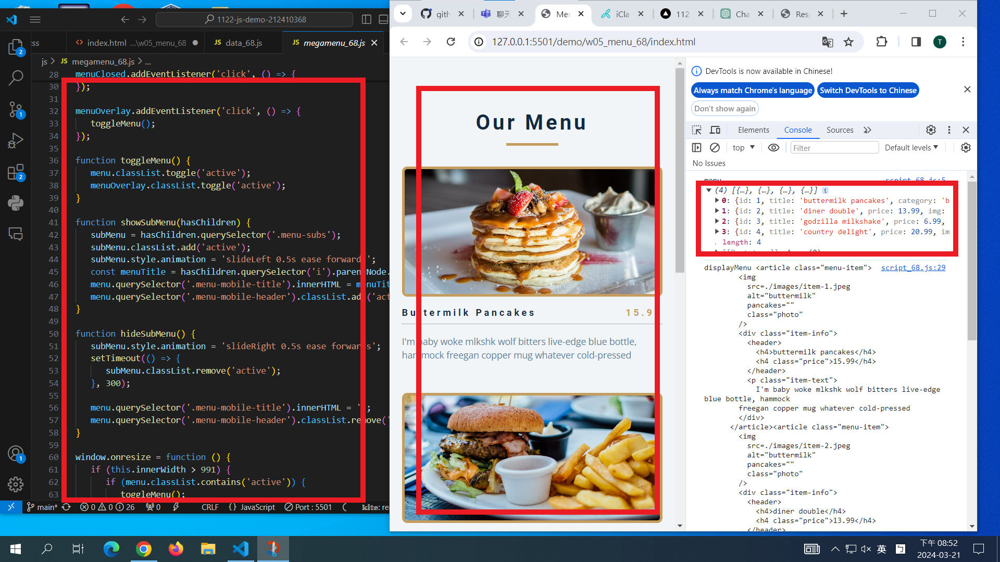
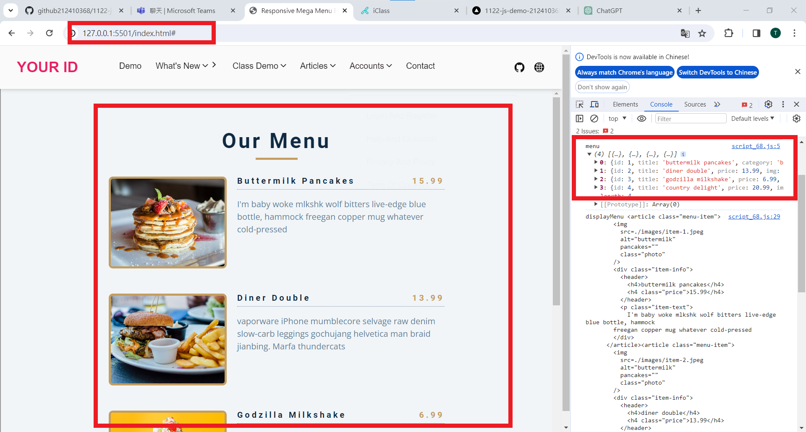
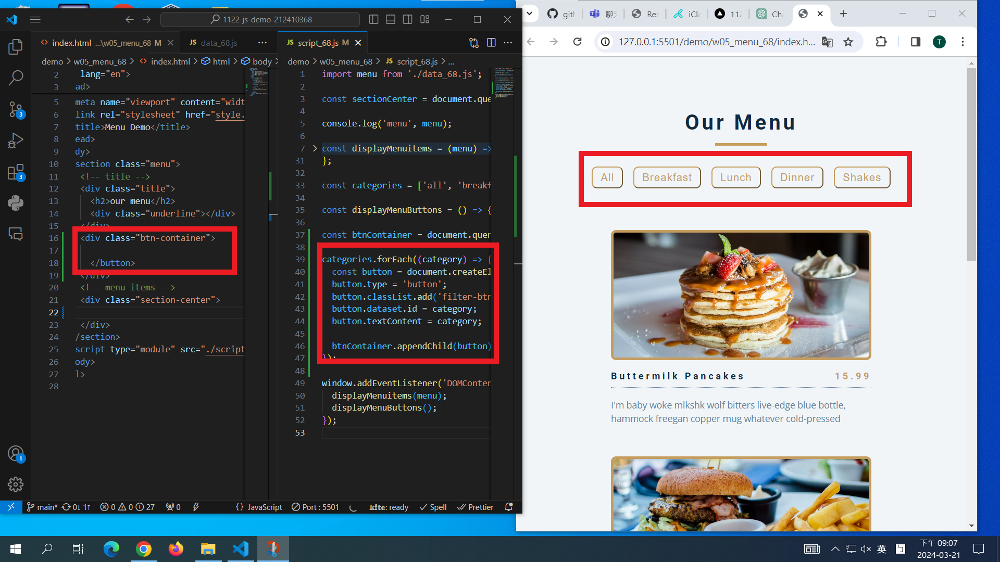

[My Github URL](https://github.com/github212410368/1122-js-demo-212410368.git)

git config --global user.email "212410368@o365.tku.edu.tw"
git config --global user.name "212410368"
git log --pretty=format:"%h%x09%an%x09%ad%x09%s" --after="2024-03-20"

### W05-P1: Use megamenu to show class demo w1~W4 locally

```
5fda0f9 212410368       Thu Mar 21 19:06:42 2024 +0800  W05-P1: Use megamenu to show class demo w1~W4 locally
```

### W05-P2: Show W05-P1 in Vercel, add github and globe icons for Github and Vercel

```
2e60f7d 212410368       Thu Mar 21 19:39:18 2024 +0800  W05-P2: Show W05-P1 in Vercel, add github and globe icons for Github and Vercel

```

### W05-P3: Display Menu Items from menu json array on both local and Vercel

#### > local



#### > Vercel



```
9880122 htchung Thu Mar 21 20:39:24 2024 +0800  W05-P3: Display Menu Items from menu json array on both local and Vercel
```

### W05-P4: Display Menu buttons from categories array (do it by yourself)



```

```

---

### W05-P5: git logs for W5

```

```
