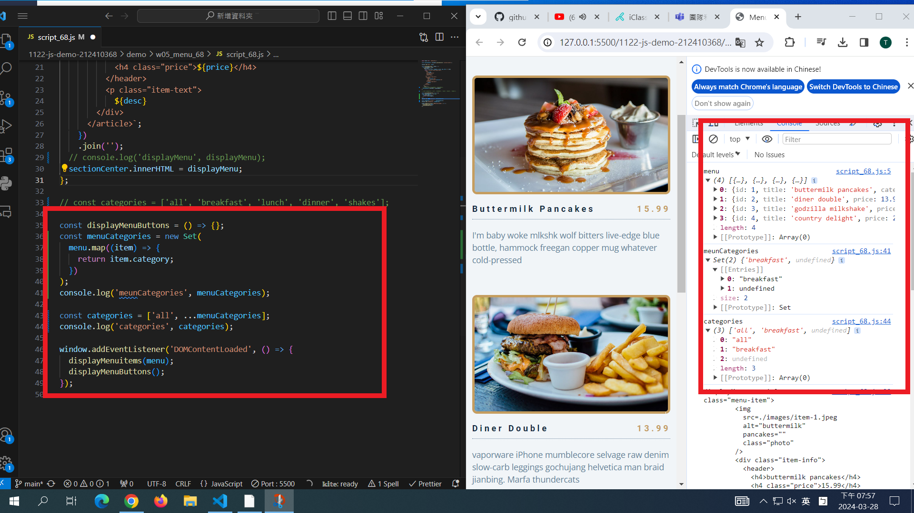

[My Github URL](https://github.com/github212410368/1122-js-demo-212410368.git)

git config --global user.email "212410368@o365.tku.edu.tw"
git config --global user.name "212410368"
git log --pretty=format:"%h%x09%an%x09%ad%x09%s" --after="2024-03-27"

### W06-P1: Create categories dynamically from data_xx.js



```
3c64280 htchung Thu Mar 28 19:49:47 2024 +0800  W06-P1: Create categories dynamically from data_xx.js
```

---

### W06-P2: Display Menu buttons from categories array


```
803202c htchung Thu Mar 28 20:12:53 2024 +0800  W06-P2: Display Menu buttons from categories array
```

---
