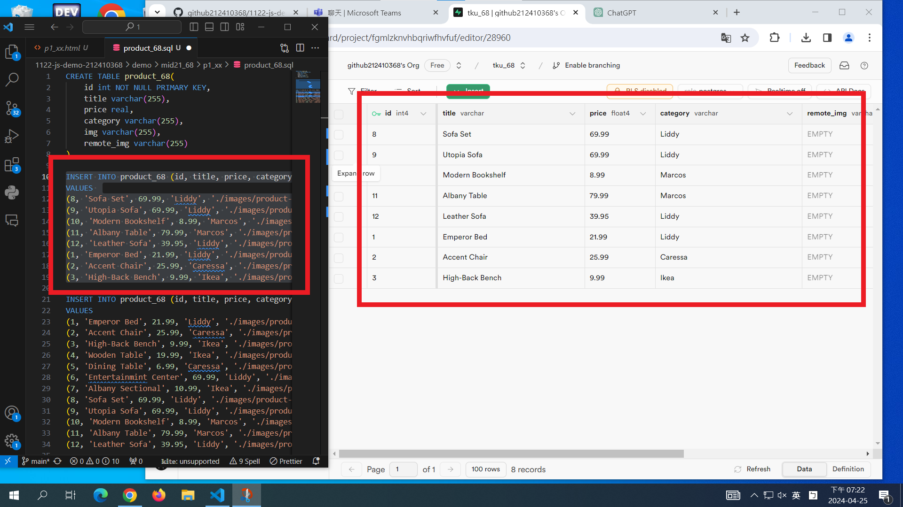
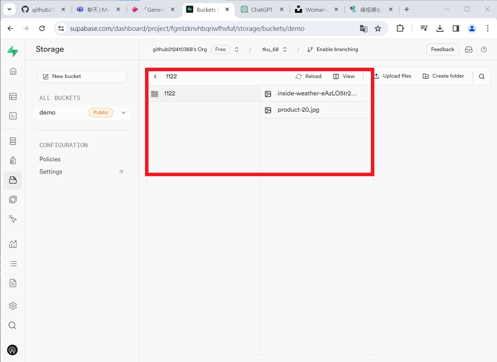
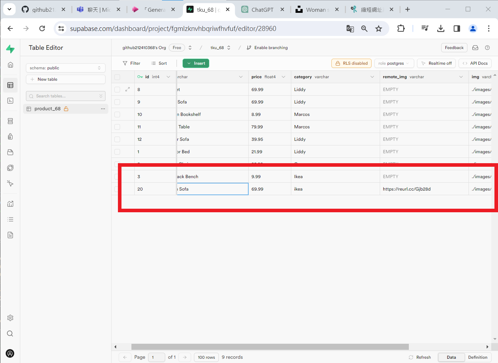
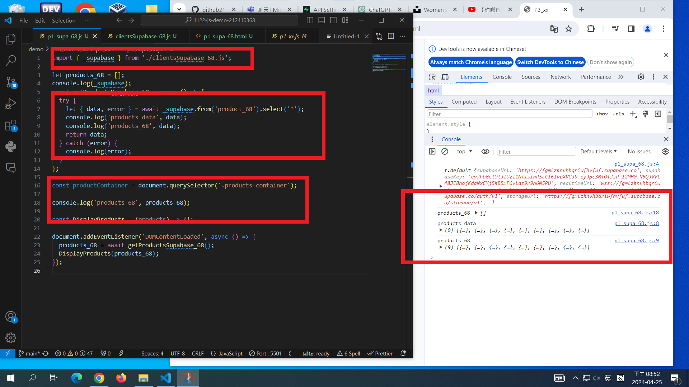
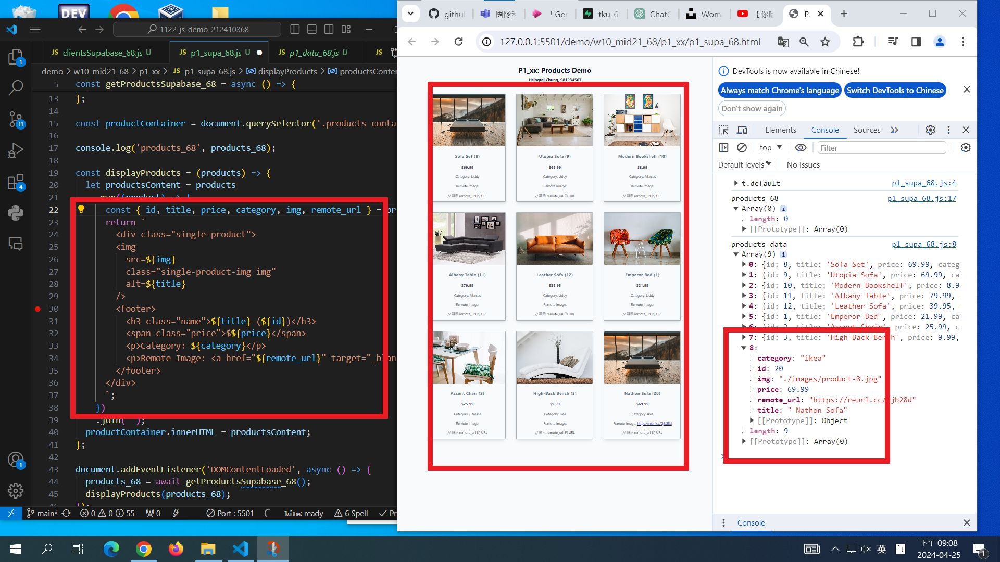

[My Github URL](https://github.com/github212410368/1122-js-demo-212410368.git)

git config --global user.email "212410368@o365.tku.edu.tw"
git config --global user.name "212410368"
git log --pretty=format:"%h%x09%an%x09%ad%x09%s" --after="2024-04-24"

### W10-P1: In Supabase, create product_xx table with 8 product data



```
3c64280 htchung Thu Mar 28 19:49:47 2024 +0800  W06-P1: Create categories dynamically from data_xx.js
```

### W10-P2: Get a photo from unsplash, and put it into storage in Supabase





```
6b30485 htchung Thu Apr 25 19:39:38 2024 +0800  W10-P2: Get a photo from unsplash, and put it into storage in Supabase
```

---

### W10-P3: Get 9 products data from Supabase, and show in console



```
f3a8ea5 htchung Thu Apr 25 20:24:47 2024 +0800  W10-P3: Get 9 products data from Supabase, and show in console
```

### W10-P4: Show products retrieved from Supabase



```
8fe93da htchung Thu Apr 25 20:48:47 2024 +0800  W10-P4: Show products retrieved from Supabase
```

---

### W10-P5: git logs for W10
