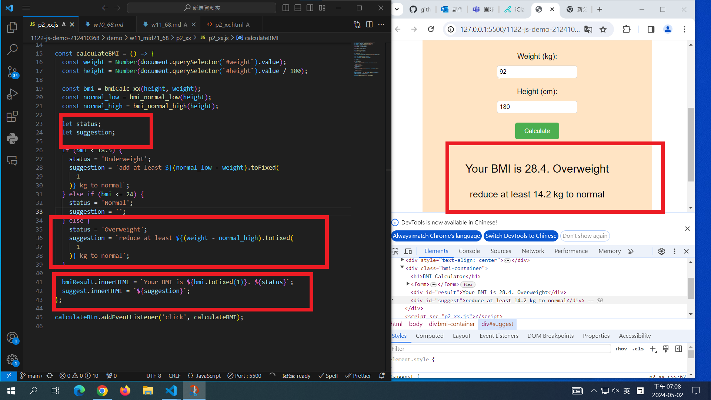
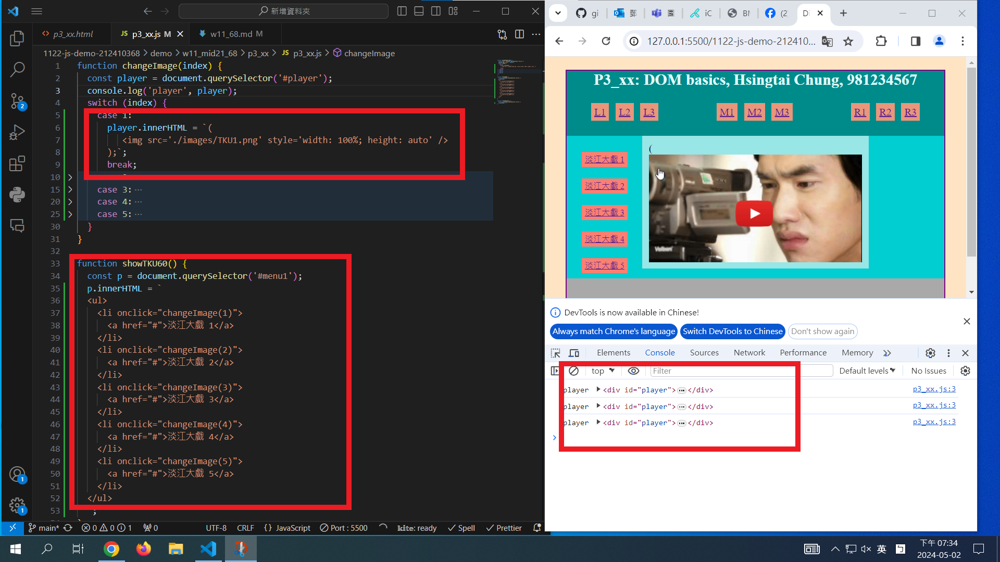

[My Github URL](https://github.com/github212410368/1122-js-demo-212410368.git)

git config --global user.email "212410368@o365.tku.edu.tw"
git config --global user.name "212410368"
git log --pretty=format:"%h%x09%an%x09%ad%x09%s" --after="2024-05-01"

### W11-P1: Answer p2_xx in mid21



```
889a96d 212410368       Thu May 2 19:10:10 2024 +0800   W11-P1: Answer p2_xx in mid21
```

### W11-P2: Answer p3_xx in mid21



```
03129fa 212410368       Thu May 2 19:36:43 2024 +0800   W11-P2: Answer p3_xx in mid21
```

---

### W11-P3: Answer for '5-promise-demo'

```
a865b7e 212410368       Thu May 2 20:41:59 2024 +0800       W11-P3: Answer for '5-promise-demo'
```
