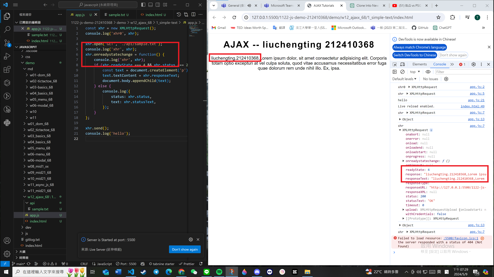
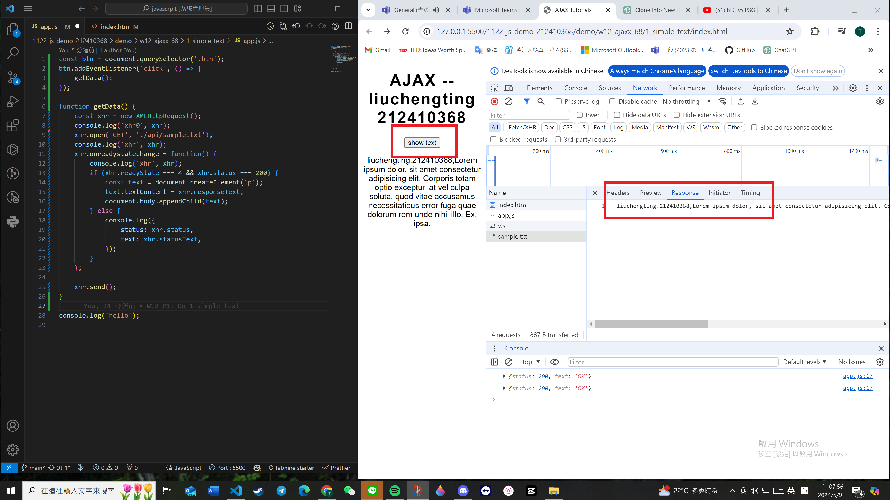
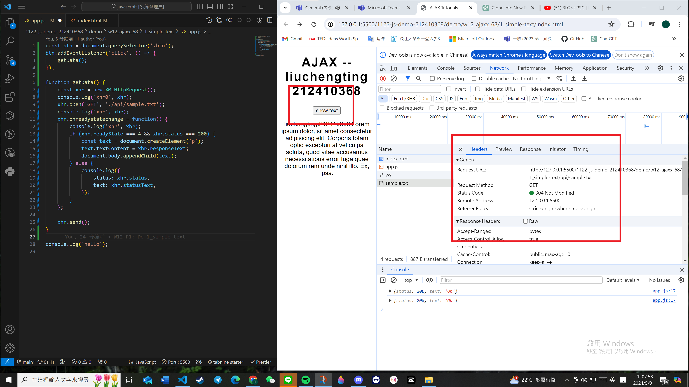
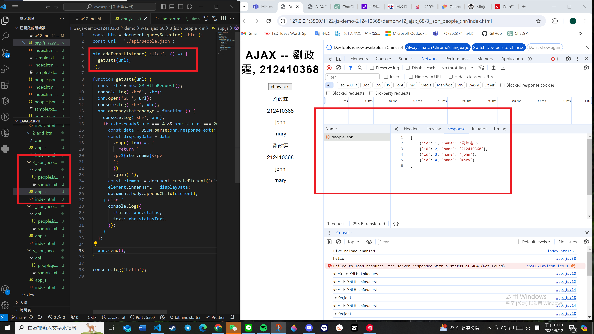
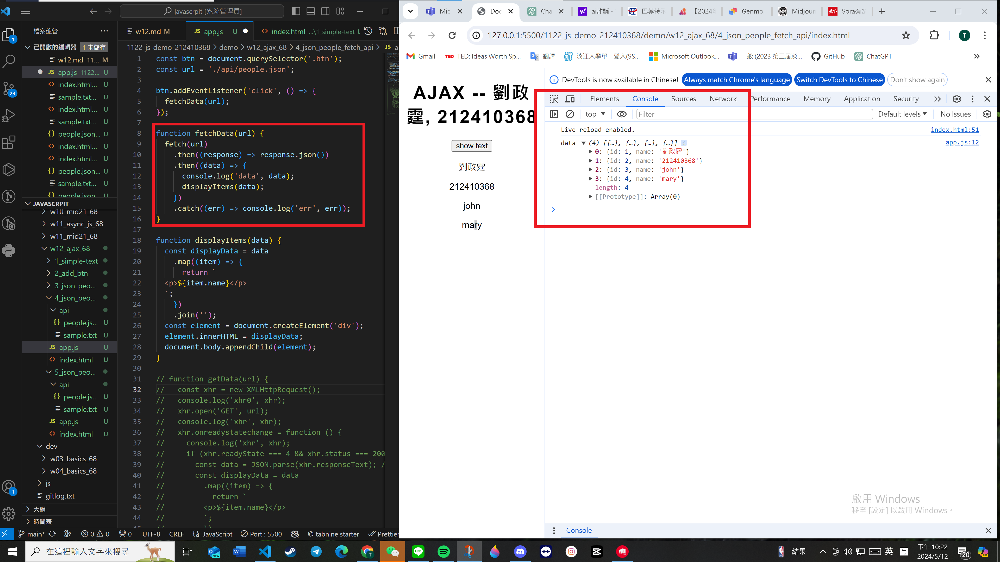
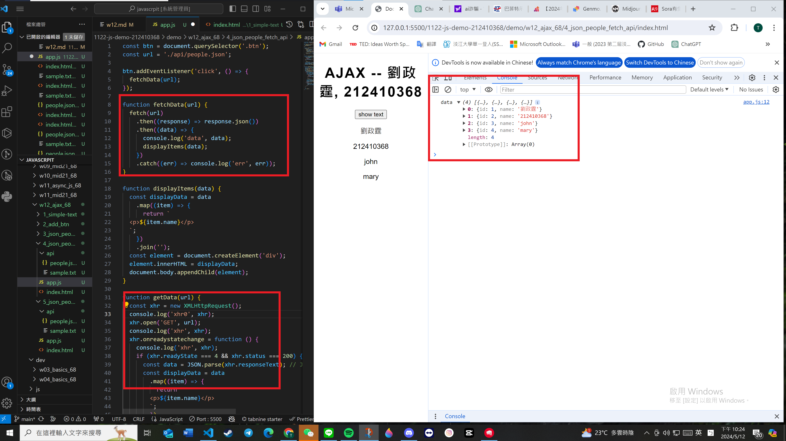
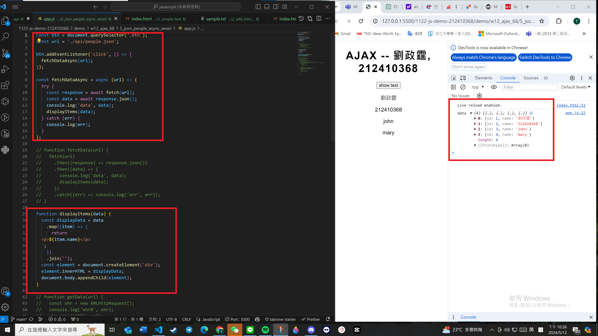

[My Github URL](https://github.com/github212410368/1122-js-demo-212410368.git)

git config --global user.email "212410368@o365.tku.edu.tw"
git config --global user.name "212410368"

git log --pretty=format:"%h%x09%an%x09%ad%x09%s" --after="2024-05-08"


### W12-P1: Do 1_simple-text
 

 
```
82a7bab 212410368       Thu May 9 19:32:13 2024 +0800   W12-P1: Do 1_simple-text
```
 
---

### W12-P2: Do 2_add_btn
 
#### => Network, Header
 

 
#### => Network, Response
 

 
```
c9b35a8 212410368       Thu May 9 20:00:17 2024 +0800   W12-P2: Do 2_add_btn
```
 
---

### W12-P3: Do 3_json_people_xhr
 

 
```
63966f0 212410368       Sun May 12 22:30:45 2024 +0800  W12-P3: Do 3_json_people_xhr
```
 
---

### W12-P4: Do 3_json_people_fetch_api 
 
#### => fetch(url).then(response => response.json())
 

 
#### => fetch api vs.xhr
 

 
```
cfe637f 212410368       Sun May 12 22:31:32 2024 +0800  ### W12-P4: Do 3_json_people_fetch_api
```
 
---

### W12-P5: Do 3_json_people_async_await
 

 
```
6b00e51 212410368       Sun May 12 22:32:05 2024 +0800  ### W12-P5: Do 3_json_people_async_await1~
```
 
---

### W12-P6: git logs for W12 ..
 
```
git log --pretty=format:"%h%x09%an%x09%ad%x09%s" --after="2024-05-08"

562f477 212410368       Sun May 12 22:33:38 2024 +0800  W12-P6: git logs for W12
6b00e51 212410368       Sun May 12 22:32:05 2024 +0800  ### W12-P5: Do 3_json_people_async_await1~
cfe637f 212410368       Sun May 12 22:31:32 2024 +0800  ### W12-P4: Do 3_json_people_fetch_api
63966f0 212410368       Sun May 12 22:30:45 2024 +0800  W12-P3: Do 3_json_people_xhr
c9b35a8 212410368       Thu May 9 20:00:17 2024 +0800   W12-P2: Do 2_add_btn
82a7bab 212410368       Thu May 9 19:32:13 2024 +0800   W12-P1: Do 1_simple-text
 
```