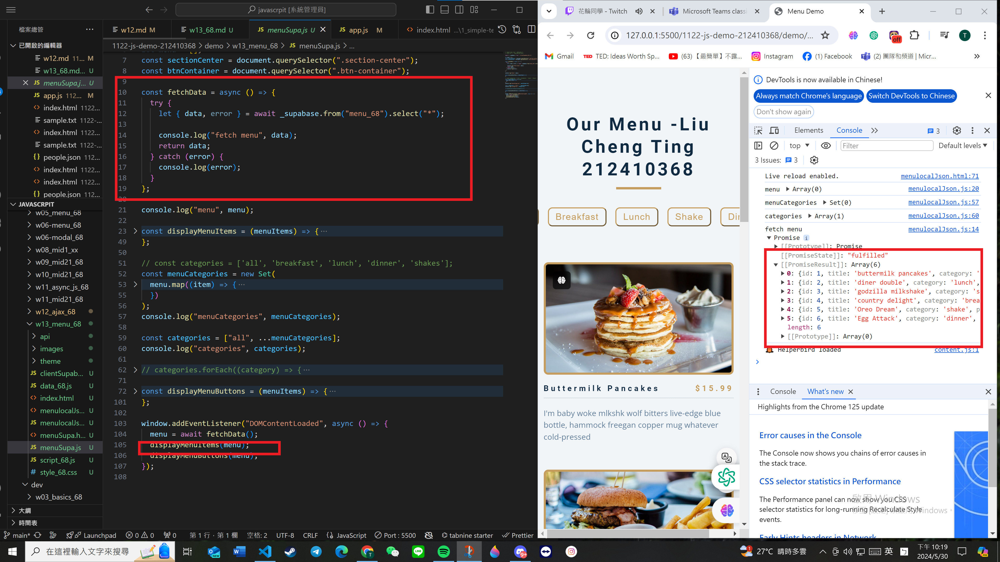

[My Github URL](https://github.com/github212410368/1122-js-demo-212410368.git)

git config --global user.email "212410368@o365.tku.edu.tw"
git config --global user.name "212410368"
git log --pretty=format:"%h%x09%an%x09%ad%x09%s" --after="2024-04-24"

W13-P1: Get 3 menu data from /api/data_xx.json



```
85d03d0 htchung Thu May 16 19:03:02 2024 +0800  W13-P1: Get 3 menu data from /api/data_xx.json
```

---

#### W13-P2: Create 3 menu data from Supabase

#### => create menu_xx table, and add 1 menu data


#### => add RLS read policy for public access


#### => add two more menu data from SQL command


#### => show 3 menu data from menu_xx table


```

```

W13-P3: Use menuSupa.html, menuSupa.js to get 3 menu data from Supabase


```

```

W13-P4: Create company_xx and store_xx tables, and insert all data

##### => data in store_xx table


##### => data in company_xx table


```
1d792a7 htchung Thu May 16 21:27:16 2024 +0800  W13-P4: Create company_xx and store_xx tables, and insert all data
```
